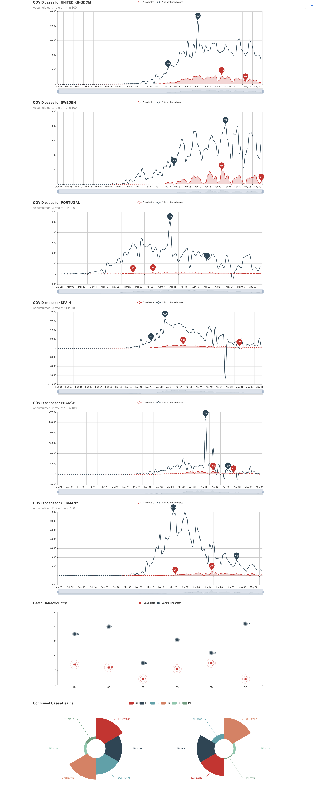

# A (depressing) dashboard for COVID stats for all countries

A simple implementation of an HTTP server presenting nice (or not so nice) summary charts for any number of countries on national statistics for COVID-19.

Data taken from public sources (https://api.covid19api.com) which might or might not be reliable or up-to-date, use at your own risk and do not take health decisions based on this data or its representation.

### Compile, and run

Compile with:

    $ go build

Run with:

    $ ./coviddash -port 4040

Or if with super-user privilidges:

    $ sudo ./coviddash -port 80
    
And finally point your browser at:

    http://localhost:4040/countries?countries=uk+se+de+es+it+pt+fr+be+dk+ie 

or

    http://localhost/countries?countries=uk+se+de+es+it+pt+fr+be+dk+ie

And use whatever list of two letter country codes you may wish to display.

### Example display

